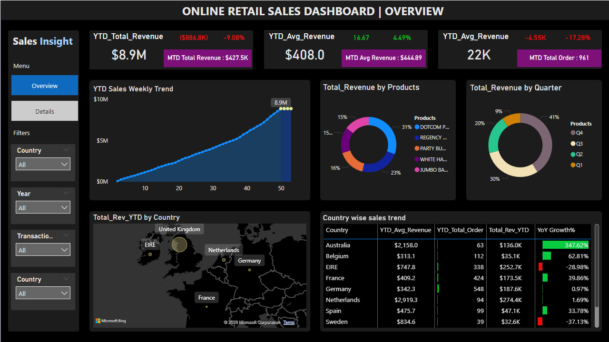

# Online Retail Sales Analysis: End-to-End Data Analytics

## 📌 Project Overview
This project provides a comprehensive analysis of online retail sales data to uncover customer purchasing behavior, sales performance trends, and revenue patterns. By integrating **Excel**, **PostgreSQL**, and **Power BI**, the project demonstrates a complete analytics workflow—from raw data cleaning to interactive dashboard reporting.

### Key Objectives
- Identify high-value customers and top-performing products
- Analyze revenue trends across time and geography
- Perform customer segmentation using RFM Analysis
- Discover purchasing behavior and sales patterns
- Build an interactive dashboard for business insights

---

## 🛠️ Tech Stack
- **Data Cleaning & Preparation:** Microsoft Excel
- **Database & Analysis:** PostgreSQL
- **Data Visualization:** Power BI
- **Documentation:** Markdown

---

## 📊 Dashboard Screenshots

### 1. Overview Dashboard

### 2. Details Dashboard

---

## 🧼 Data Cleaning (Excel)
Before analysis, the dataset was cleaned and prepared using Excel to ensure data integrity.

### Cleaning Steps Performed
- Removed/handled null values in critical fields (e.g., Customer IDs)
- Checked and removed duplicate records to prevent revenue inflation
- Standardized formatting for dates and numeric columns for SQL compatibility
- Prepared dataset for relational database import and dashboard creation

---

## ⌨️ Business Analysis (SQL)
Using **PostgreSQL**, multiple analytical queries were performed to solve business problems and uncover actionable insights.

### Key Analysis Performed
*   **Customer Segmentation:** RFM Analysis (Recency, Frequency, Monetary)
*   **Sales Trends:** Monthly Revenue, Peak Sales Hours, and Revenue by Weekday
*   **Product Performance:** Top-selling products and Product Velocity analysis
*   **Geographic Insights:** Revenue contribution by country
*   **Advanced Analytics:** Market Basket Analysis and New vs. Returning customer revenue

---

## 📈 Power BI Dashboard Insights
An interactive multi-page Power BI dashboard was developed to visualize sales performance and customer behavior.

### Dashboard Features
- **KPI Tracking:** Real-time cards for Revenue, Orders, and Average Revenue
- **Trend Visuals:** Weekly and Quarterly revenue growth distribution
- **Mapping:** Country-wise sales distribution
- **Granular Detail:** Detailed transaction-level insights with interactive filters

---

## 💡 Key Insights
- **United Kingdom** generated the highest overall revenue compared to other regions.
- Revenue showed a strong growth trend toward the end of the year (**Q4**).
- A small group of high-value customers contributed significantly to total revenue.
- **Returning customers** showed a higher revenue contribution than new customers.
- Sales activity peaked during specific business hours, identifying optimal windows for marketing.

---

## 🚀 Files Included
- **Power BI Dashboard File:** `.pbix`
- **PostgreSQL SQL Script:** `.sql`
- **Dashboard Screenshots:** `.png` files
- **Documentation:** `README.md`

---

## 👤 Author
**Prabha R**
