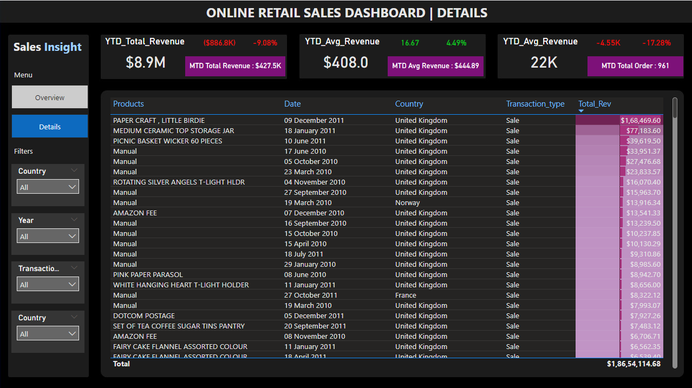

# Online Retail Sales Analysis

## Introduction
This project analyzes online retail sales data to uncover customer behavior, revenue trends, and product performance using Excel, PostgreSQL, and Power BI.

---

## 📊 Dashboard Screenshots

### 1. Overview Dashboard

### 2. Details Dashboard

---

## Data Collection
Dataset includes:
- Customer ID
- Invoice Number
- Product Description
- Quantity
- Unit Price
- Invoice Date
- Country

---

## Data Cleaning
Preprocessing steps include:
- Handling null values
- Removing duplicate records
- Standardizing date & numeric formats
- Preparing data for SQL analysis and dashboarding

---

## Data Analysis
Key analysis performed:
- RFM Customer Segmentation
- Monthly & Quarterly Revenue Trends
- Peak Sales Hour Analysis
- Country-wise Revenue Analysis
- Top-Selling Products
- Returning vs New Customer Analysis
- Market Basket Analysis

---

## Data Visualization
Dashboard insights include:
- Revenue & Order KPIs
- Sales Trend Analysis
- Country-wise Sales Mapping
- Product Performance Tracking
- Interactive Filters & Drilldowns

---

## Tech Stack
- Excel
- PostgreSQL
- Power BI
- Markdown

---

## Tools & Concepts Used
- Excel Data Cleaning
- PostgreSQL Queries
- Power BI Dashboarding
- RFM Analysis
- Market Basket Analysis
- KPI Reporting

---

## Key Insights
- United Kingdom generated the highest revenue
- Returning customers contributed higher sales
- Revenue peaked during Q4
- High-value customers drove major revenue share
- Sales activity increased during business hours

---

## Files Included
- Power BI Dashboard (.pbix)
- SQL Queries (.sql)
- Dashboard Screenshots (.png)
- Documentation (README.md)

---

## Author
Prabha R
---
